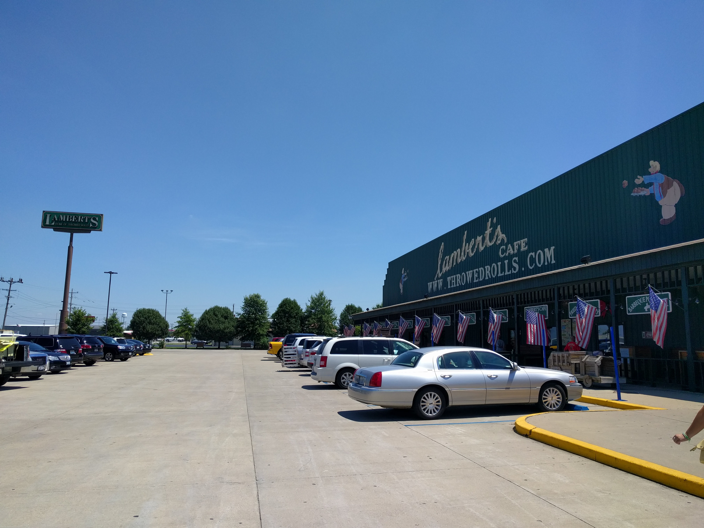
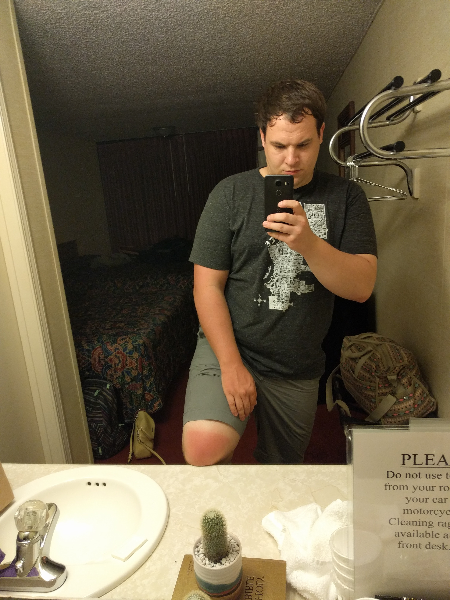

There are a whole lot of trees in the United States.

Today was another day on the road. At 8 o'clock, we checked out of our Cave City motel and hit the road for Arkansas.

<figure>
	<iframe src="https://www.google.com/maps/embed?pb=!1m28!1m12!1m3!1d3245803.1696221144!2d-92.10126631387638!3d37.3962251298994!2m3!1f0!2f0!3f0!3m2!1i1024!2i768!4f13.1!4m13!3e6!4m5!1s0x8866192897490523%3A0x2431cc240d7718bc!2s1009+Doyle+Avenue%2C+Cave+City%2C+KY+42127%2C+USA!3m2!1d37.1334896!2d-85.97486049999999!4m5!1s0x87ced2bba8be17db%3A0x546f1eb7f15a492d!2sCandlewick+Inn+%26+Suites%2C+2094+E+Van+Buren%2C+Eureka+Springs%2C+AR+72632!3m2!1d36.3918363!2d-93.73029969999999!5e0!3m2!1sen!2sus!4v1470800470618" width="800" height="600" frameborder="0" style="border:0" allowfullscreen></iframe>
	<figcaption>Today's route</figcaption>
</figure>

Not long after heading out, we stopped for breakfast at a Waffle House. I'd never been to one before—I don't think there are any as far north as Wisconsin—but it was great. The epitome of an American breakfast diner, they don't offer anything particularly revolutionary, but the scrambled eggs with cheese, hashbrowns, and waffle that I had were all delicious. I think we'll probably stop there for breakfast again before we return to the barren north.

Surrounding our few minutes back in Illinois, we crossed the Ohio and Mississippi rivers. It was slightly scary being over so much water on surprisingly narrow bridges, but it was even more enrapturing.

After a couple more hours on the road, although neither of us were very hungry yet, we passed a billboard advertising [Lambert's Cafe][lamberts] and their famous throwed rolls, and stopped at their Sikeston location soon after. I had a BBQ pork steak with baked beans, potato salad, and applesauce. All good. I also managed to catch both of the hot rolls that were _throwed_ at me, surprisingly.

Just before reaching Seymour, MO we hit a spot of heavy rain. It knocked visibility down to only about a car length or two. It wouldn't have been too terrible, but the trucker driving the semi behind us didn't think it was bad enough to slow down for; the spray from his truck once he passed us made it nearly impossible to see. Nonetheless, it cleared up after only about 15 minutes.

Soon after, we passed by an Amish community and several horses and buggies. Not an entirely uncommon sight, but interesting.

About halfway through the drive we finished _Into the Wild_. The ending wasn't any more spectacular than the beginning. I don't regret listening to it or buying it, but I don't think I would recommend it to anyone. I rated it 3 out of 5 stars on Audible.

Thus far, the drive had been pretty uneventful. A more scenic drive than our first day, there were many beautiful landscapes of forests, valleys, and hills. Though pretty, the drive itself wasn't particularly interesting. About two hours from our destination, that changed entirely. We began a series of ascents and drops over the gorgeous and hilly Missourian highways. After another hour or so, we left the multilane interstate for a much smaller and extremely curvy rural highway, and a few smalltown streets. Young cows peppered both sides of the road, and confederate flags decorated the locals' homes and trucks.

Ten hours, a sore right thigh and a very sunburned left arm and leg after leaving Cave City, Kentucky, we arrived at the Candlewick Inn in Eureka Springs. After checking into our motel room, we dined at the [Rowdy Beaver][rowdy-beaver]. Nothing particularly amazing, but a good meal. On our way back to the motel, we checked out downtown Eureka Springs. It's very pretty, I'm looking forward to checking it out tomorrow afternoon when the sun is still out and the shops are still open.

[lamberts]: http://www.throwedrolls.com/
[rowdy-beaver]: http://www.rowdybeaver.com/
