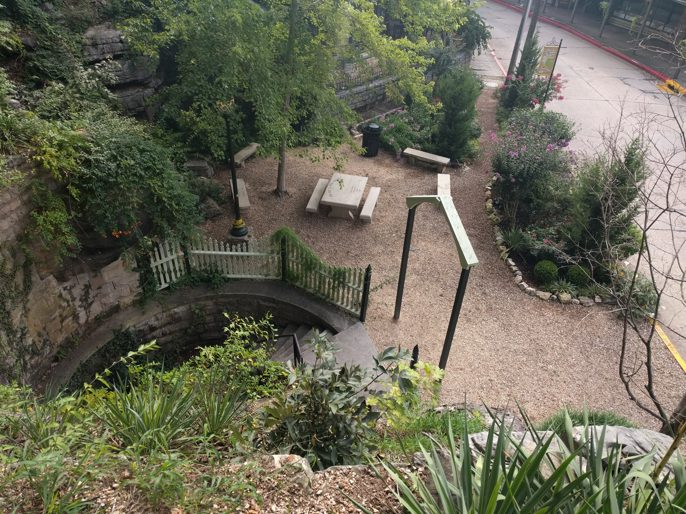
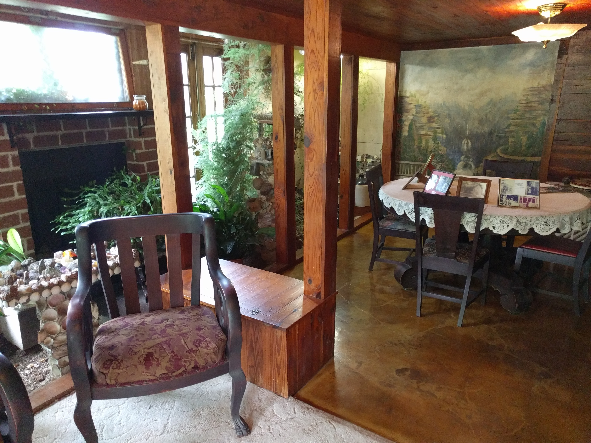
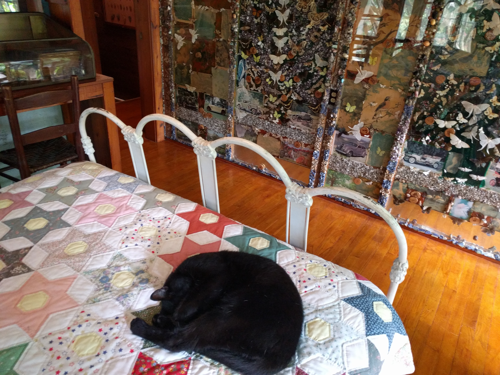
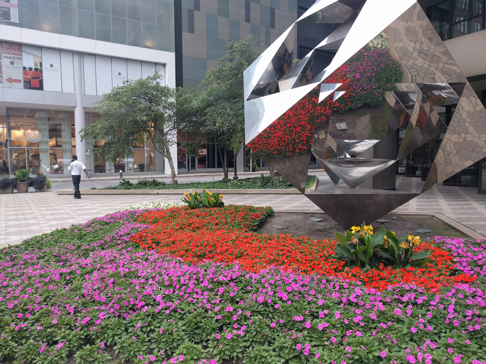

There wasn't a whole lot to write about today, most of the time was just spent in the car driving to St. Louis.

The main attraction for today was [Quigley Castle][quigley], which we were finally able to see. While it was supposed to open at 8:30, we found a sign at the gate saying it would be opening at 10 instead, so we had a little time to kill. We went back for our final view of downtown Eureka Springs, and to try to find a couple of the actual springs. We only ended up finding two, but on the way back we witnessed an old lady back into the car ahead of us when moving out of the way of a turning semi on the narrow street. Glad we were able to see that before leaving.

At 10 we returned to the castle. It was a very neat place, though the building's exterior was pretty ugly being just rocks stuck into mortar. Regardless, the structure of the building itself and its contents were neat. It featured plants growing indoors, a wall made of butterflies, and a sleepy cat and two fat little dogs. Worth the $7 for sure.

After driving for a few hours we took a pit stop in the Lane Spring section of Mark Twain National Forest. There wasn't much to it, but the little spring was very pretty. A little ironic that the best spring we visited wasn't in Eureka Springs.

After another hour and a half we arrived in St. Louis. After checking into our hotel and me taking a shower, we headed downtown. We had dinner reservations at [Mango][mango] for 7:15, so we parked near the restaurant and walked around for a half hour until we were able to be seated.

After arriving a bit underdressed and a bit oversweaty, I had _Pescado a lo Macho_, a Peruvian take on mahi mahi. It was very good, and the caramel filled cake I had for dessert was even better.

As we were finishing our entrées, it started pouring outside. Since the rain put an end to any more downtown sightseeing, after finishing our desserts and building courage we ran the two blocks to the car and headed back to the hotel.

A pretty uneventful day, but I'm excited to get some more time tomorrow in St. Louis. It's a classic American city, pretty similar to Milwaukee, and I really like it so far.

[Google Photos album][photos]

[quigley]: http://www.quigleyscastle.com/
[mango]: http://www.mangoperu.com/
[photos]: https://goo.gl/photos/qZ59yUqNdiYnSerK7
