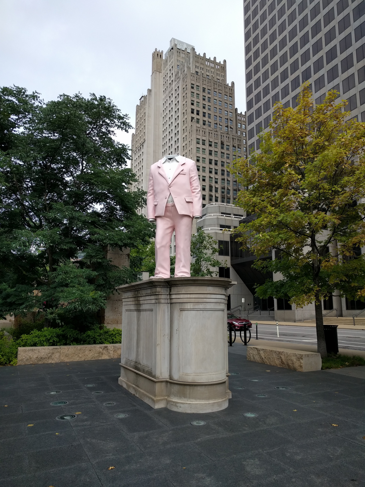
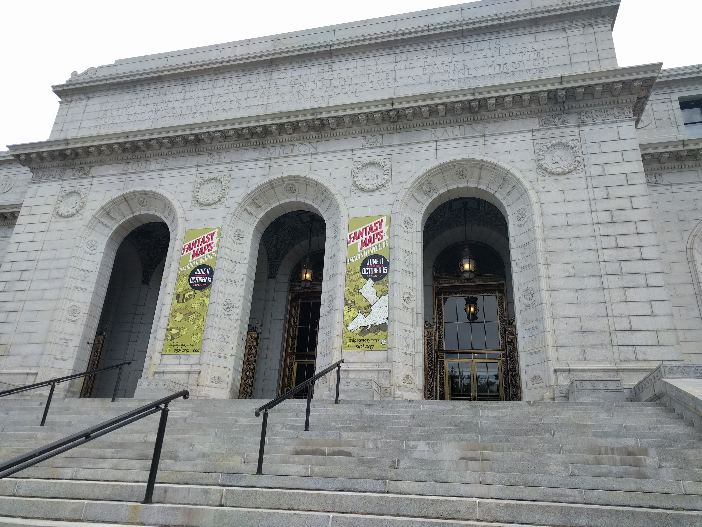
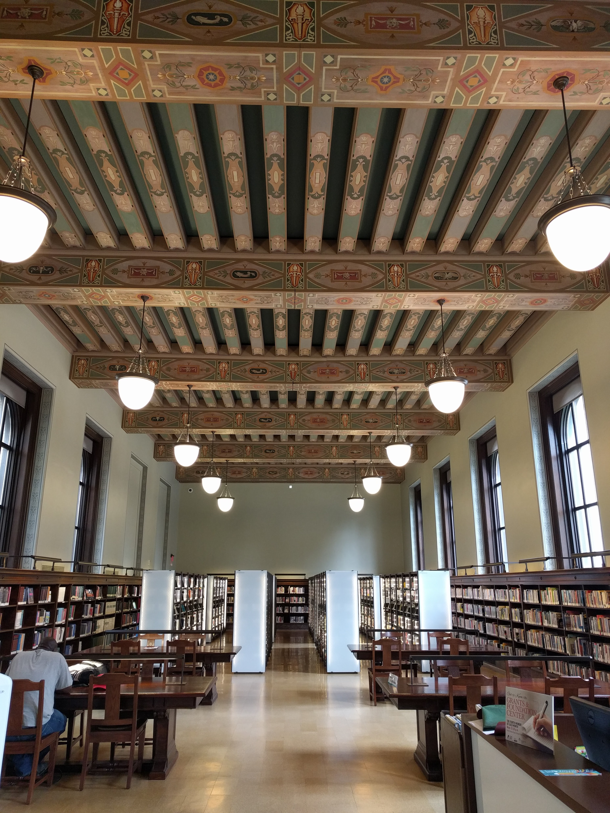
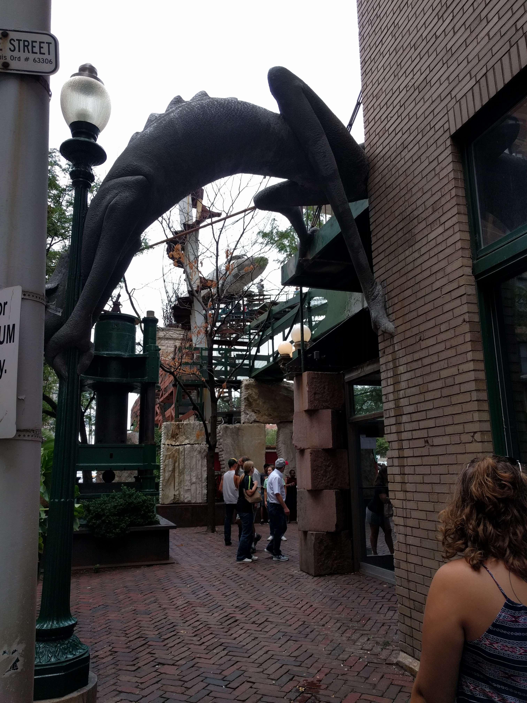
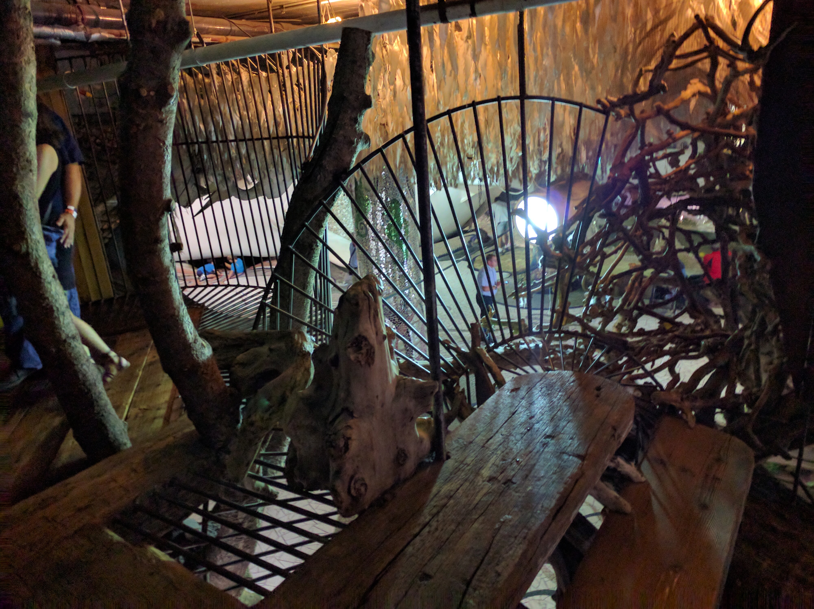
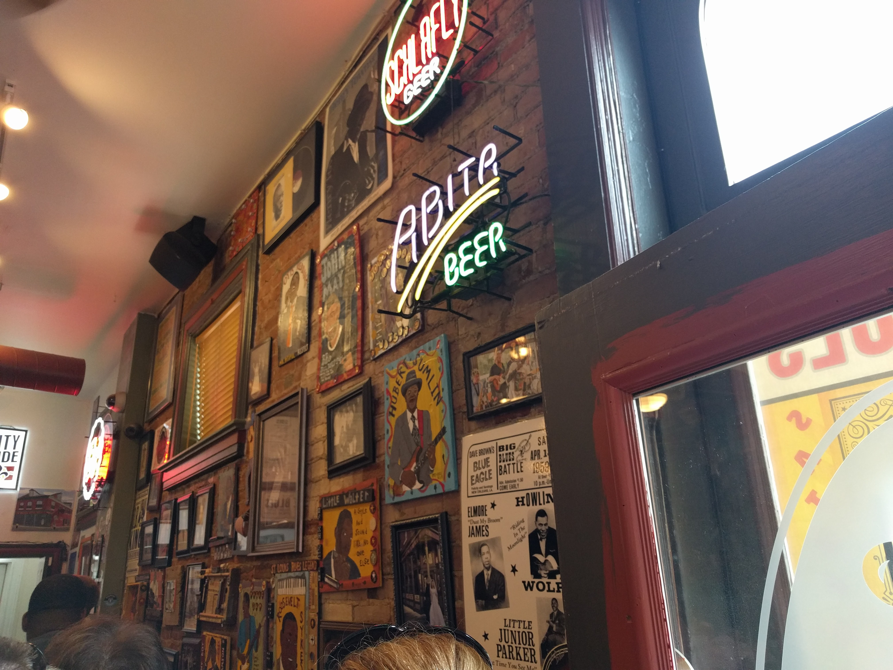
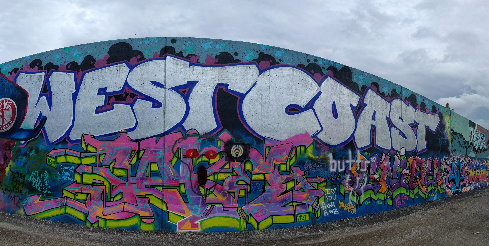
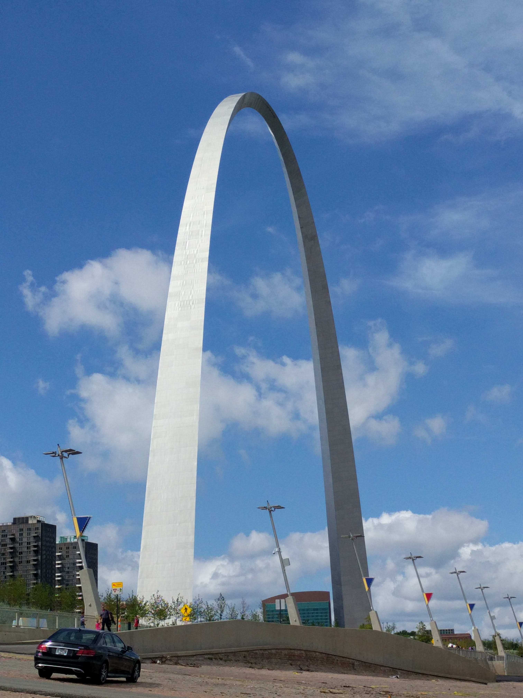

Today we'll be returning home, so we spent the morning sightseeing around St Louis before heading homeward bound at 5.

We started the day with a breakfast at [Rooster][rooster], voted "best breakfast in Missouri". At 9 o'clock it wasn't packed yet, but it definitely wasn't dead by any means. It's a nice place with a focus on local, farm-fresh ingredients and simple but tasty arrangements of them. I had the rooster slinger, a local favorite that was also recommended to me by a friend. It was like a breakfast chicken à la king with chorizo and gravy. The chorizo was a little overpowering, but overall it was very good.

After finishing our breakfasts and very dark-roasted coffees, we walked a few blocks to the [Citygarden][citygarden]. I didn't know this place existed until seeing it on the map, but it's really interesting. There are many modern and minimalist sculptures and works of art strewn about the couple-block garden of flowers and trees. St Louis isn't as much like Milwaukee as I originally thought; while it is a classic American city, the artwork, signage, and monuments seem to be a lot more modern.

After walking around the garden, we walked a few blocks until we came to the [Central St Louis Public Library][library]. I love libraries and I love big and interesting buildings, so I really enjoyed it. Soon after walking into the main hall I came across a wall of photos from the early 1900s construction; it's so impressive how these massive marvels of architecture were made with so few modern tools, just man's mind and body. Very interesting.

The interior is a perfect blend of the original architecture and modern additions. I love it. I'm incredibly jealous that I don't live in St Louis because of it, I could spend days inside. Once back home I'm going to finally get my Milwaukee library card and hope that the building is only half as amazing.

After the library, we walked back to where we parked the car. On the way, we walked by Rooster again, noting how unsurprisingly packed it had become a few hours later; I'm glad we got there when we did. We then drove a few blocks to the [City Museum][city-museum]. Another very interesting place.

Focused on a younger audience, the museum was still interesting and enjoyable. We spent a little time crawling up and into some of the many tight spaces and looking around a bit, and then we came to the entrance of the cave, the location of the fabled 10-story slide. I was once again winded and very sweaty after climbing up those ten stories' stairs to reach the roof.

There were more things to look at and do on the roof, but thankfully at least the breeze made it much cooler than the small area with the stairs, and after cooling off we headed back inside to descend the slide at last. The slide was disappointing. Its angled construction and tight spirals made it impossible to gain any real speed, and it was incredibly uncomfortable going down. Unfortunate.

We then walked a couple blocks to the [Campbell House Museum][campbell]. A tour inside costs $8, and I had exactly that much cash on me, so I went inside alone. My tour guide was extremely kind and personable, and took me on a slightly sped-up version of the tour through the house and the history of its owners. It's much larger on the inside than it looks, and is filled with original pieces of furniture and other personal items from the Campbells. I really liked it, I definitely recommend it. From there we took a short drive to and through the [Bellefontaine Cemetery][cemetery], where the Campbells themselves are buried.

It was now about 2pm, so we headed to the [Blues City Deli][deli] for a late lunch. It was expectedly busy, but after waiting in line for only about 10 minutes we were seated at an outdoor table, and five minutes later my sandwich and our potato salads were brought out to us. I had the first thing on the menu, the Benton Park, and it was delicious. The potato salad was also interesting; it was good, though it tasted noticeably sweet. It was the best sandwich I've ever eaten, definitely worth its many awards and acclaims.

We were both getting pretty tired by this point and ready to be home, so we left to visit our two final sights: the arch and a nearby wall famous for its graffiti. We parked on an angled, bricked area touching the Mississippi River and walked about half of the mile-long wall. I was honestly expecting a little more from the graffiti artists, but I'm glad we looked at it. Goodbye for now, St Louis.

After getting back to the car, we took a few minutes to look at the arch in all its glory, then hit the road for Whitewater, Wisconsin. The drive felt pretty long despite being relatively quick and uneventful.

It was a very nice vacation, and I'm very happy we were able to do it. It's good to be home though.

[Google Photos album of St Louis][st-louis-photos]

[Album for entire trip][photos]

[rooster]: http://roosterstl.com/
[citygarden]: https://en.wikipedia.org/wiki/Citygarden
[library]: http://www.slpl.org/index.asp
[city-museum]: http://www.citymuseum.org/
[campbell]: http://www.campbellhousemuseum.org/
[cemetery]: http://bellefontainecemetery.org/
[deli]: http://www.bluescitydeli.com/
[st-louis-photos]: https://goo.gl/photos/GYt8E3WEmjCFQJgj9
[photos]: https://goo.gl/photos/TmTErdqbMjxqtuuJA
