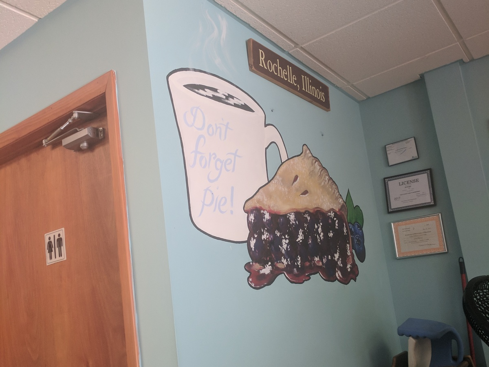
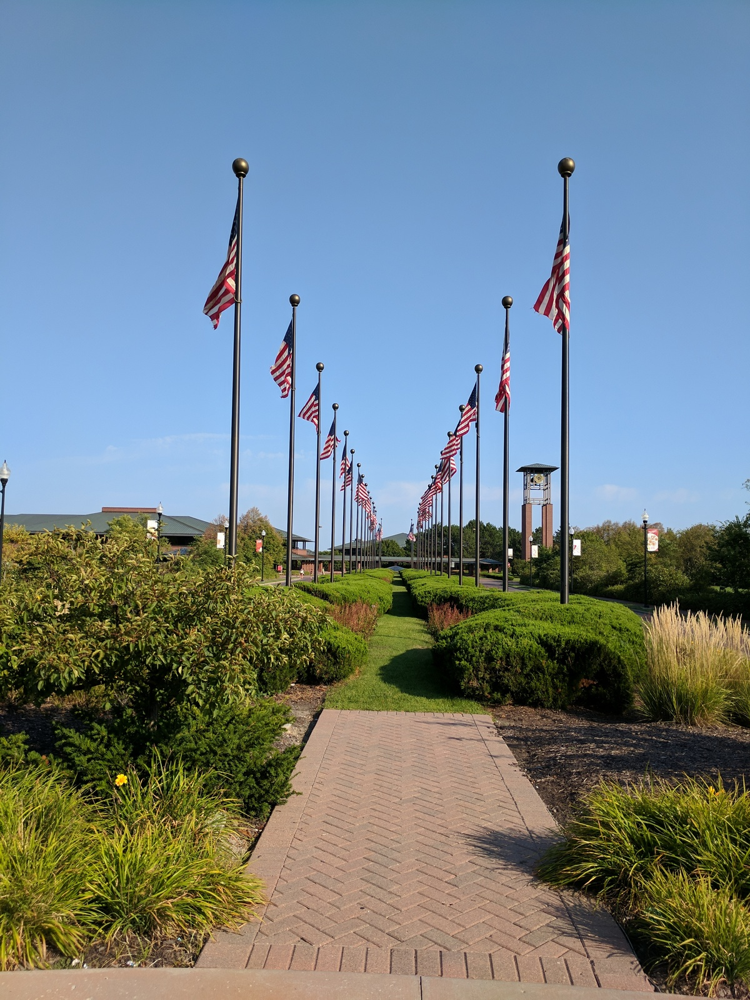

We left this morning for our second annual summer national park road trip; this time to the American West. Today's agenda was pretty light, mainly making the 8ish hour drive to Omaha, Nebraska.

We departed at about 7am, with nothing terribly exciting to do until we stop for breakfast. We listened to [Aziz Ansari's Modern Romance][modern-romance], which so far is better than I expected, filled with a lot of legitimate research and information thrown in with Aziz's occasional jokes.

We stopped for breakfast at [Off The Wall][off-the-wall] in Rochelle, IL. I had their eponymous Off The Wall Skillet, with normal skillet ingredients, as well as breaded chicken; pretty good. They also give you an option of pancakes instead of toast, which is genius and every place should do that. I was too full for pie afterward.

	<figure>
		
	</figure>
	<figure>
		
	</figure>
	<figure>
		
	</figure>

Next we stopped at the _super exciting_ [World's Largest Truckstop][truckstop], which wasn't all that large in size but it did have such amenities as showers, a theater, a barber, a dentist, public laundry, and a chiropractor, as well as the gift shops, convenience stores, restaurants, and a trucking museum. It's actually slightly more impressive than "world's largest truckstop" sounds.

	<figure>
		
	</figure>
	<figure>
		
	</figure>

We stopped for lunch in Des Moines, Iowa, the home of convention centers and one-way streets, and the saddest city in the midwest. We ate at [Wasabi Tao][wasabi], a trendy sushi place, after battling one-ways and construction for around 10 minutes. I had the Out of Control roll; it was I believe the first baked sushi I've ever had and above average. After a quick stop at Starbucks we were again Omaha-bound.

## Omaha

To our dismay, the zoo, gardens, and museum were all closing when we arrived, so we headed downtown. Old Downtown Omaha is trendy. Much hipper than I expected. We bought shirts at a local artwork clothing shop, I bought another shirt at a vintage clothing shop, we bought some candy, stopped in a massive collectibles shop named the Imainarium, looked at the breathtaking photos of Thomas Mangelsen in his [Nature Gallery][mangelsen], and explored the neat downtown area.

	<figure>
		
	</figure>
	<figure>
		
		<figcaption>
			This shirt was $70.
		</figcaption>
	</figure>
	<figure>
		
		<figcaption>
			Underground "passageway" with more shops.
		</figcaption>
	</figure>
	<figure>
		
	</figure>
	<figure>
		
		<figcaption>
			A neat garden with a bunch of scary heads
		</figcaption>
	</figure>
	<figure>
		
		<figcaption>
			One of the heads.
		</figcaption>
	</figure>
	<figure>
		
		<figcaption>
			Some more heads, spitting water this time.
		</figcaption>
	</figure>
	<figure>
		
	</figure>
	<figure>
		
	</figure>
	<figure>
		
	</figure>
	<figure>
		
	</figure>

After walking around for about an hour we were getting pretty hungry so we grabbed a delicious pizza from the friendly and hospitable people at [Orsi's Italian Bakery and Pizzeria][orsis] and ate it in the park. Then we stopped by the Midwest Office of the National Parks Service and walked halfway across the long and shockingly elastic [pedestrian bridge][ped-bridge].

	<figure>
		
	</figure>
	<figure>
		
	</figure>

It was getting dark by then, so we finally went to check into our hotel. Despite being relatively inexpensive, the [Aksarben Suites][aksarben] is a pretty and comfortable place to spend the night. We hit up the pool for a little bit before turning in, where I stayed up much longer than I should have writing this post.

	<figure>
		
	</figure>
	<figure>
		
	</figure>
	<figure>
		
	</figure>

Tomorrow we're heading to Valentine, NE to check out the [Fort Niobrara National Wildlife Refuge][niobrara].

---

[_Full trip album_][photos]

[modern-romance]: https://www.audible.com/pd/Nonfiction/Modern-Romance-Audiobook/B00UKEQK82
[off-the-wall]: http://www.offthewallcafe.com/
[truckstop]: https://iowa80truckstop.com/
[wasabi]: http://www.wasabidsm.com/
[mangelsen]: http://www.mangelsen.com/
[orsis]: http://orsibakery.com/
[valentine]: https://visitvalentine.org/
[niobrara]: https://www.fws.gov/refuge/fort_niobrara/
[photos]: https://goo.gl/photos/s6D4FYv8uWmbNhiT8
