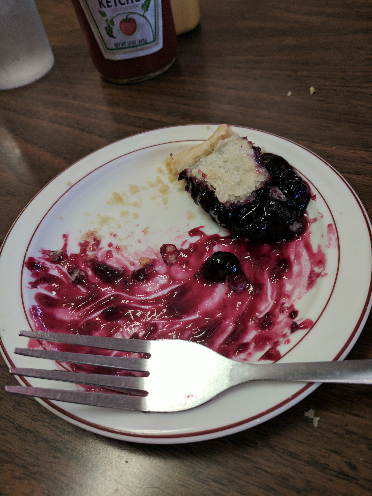
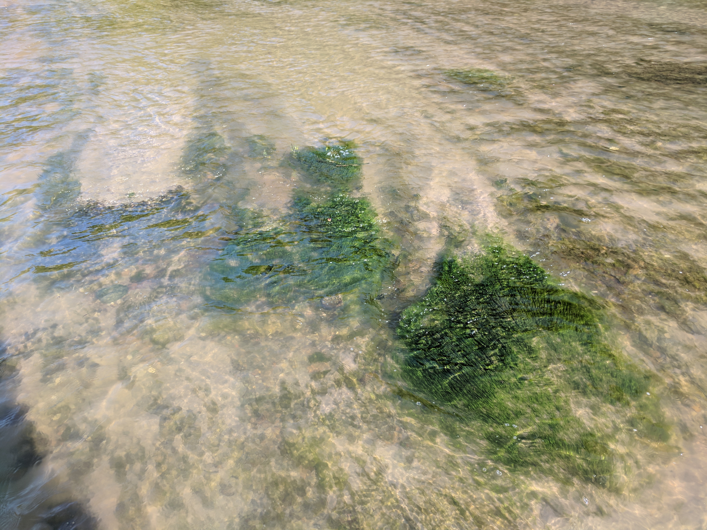
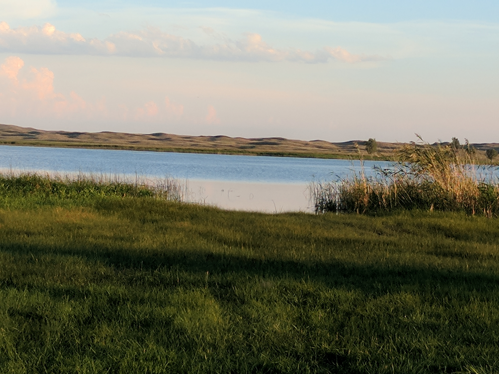
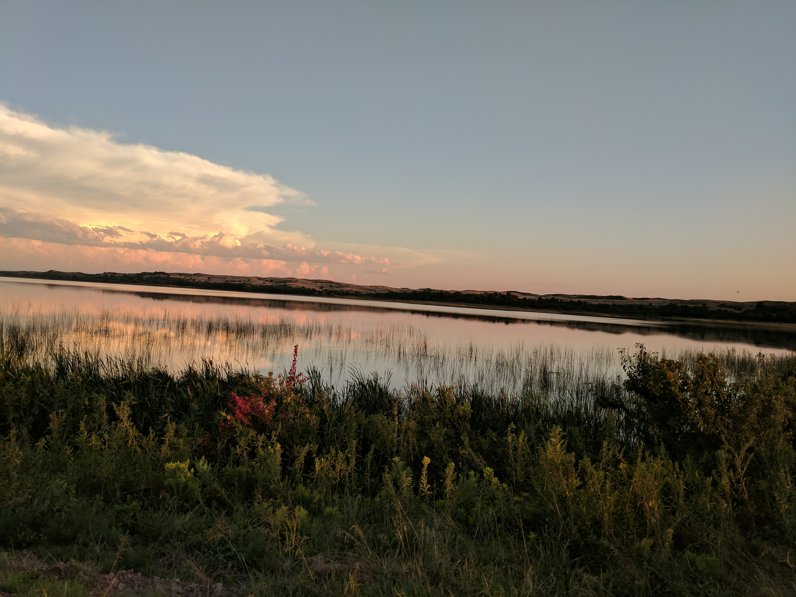
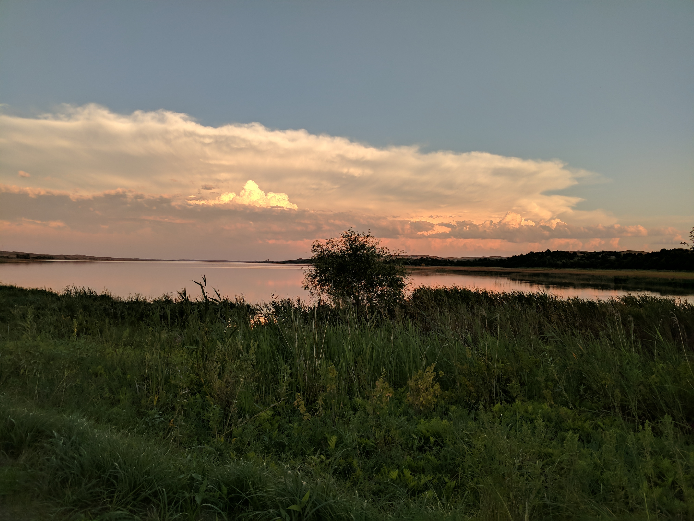

After snoozing through two alarms I went down to the fitness center to counteract some of the calories from yesterday. A few miles and a shower later we went down to the common area for the complementary and non-notable breakfast.

After wasting another half hour on this blog we checked out and headed on our way to check out the garden that was closed to us yesterday before departing for Valentine. After parking in its lot, before exiting the car, I thought it would be a good idea to check the travel time. A stroke of fortune that I did, because what I thought was a two-hour drive was actually a little over five.

We decided to not even spend any time at the garden, and got right back on the highway and drove back the way we came, westward toward Valentine.

The drive was uneventful, interspersed with quick stops for gas.

At around 3:30 we arrived. We checked into our hotel and left to find something to eat, after a quick stop at the visitor's center. We ate at the Candlelight Inn on Main Street, where I had a cream cheese, jalepeño jam, and bacon burger and a slice of blueberry pie. The burger was interesting and tasty, and the pie was great.

	<figure>
		
		<figcaption>
			The sidewalks of Valentine's Main Street were covered in these pleasant little hearts.
		</figcaption>
	</figure>
	<figure>
		
	</figure>

The ranger at the visitor's center told us the most fun thing to do was to kayak down the river to the tallest waterfall in the country, so our plan was to pay a visit the Reserve to look for bison and then see if we could rent a couple kayaks until dusk. We failed on both counts, we did not see any bison and the kayak rides last over 4 hours and the last one for the day pushes off at noon. Rats.

We drove back up the river to see a smaller and more accessible waterfall; descending a brief set of stairs was all required of us. A recently-erected fence prevented us from getting close enough to be showered in its waters, but we basked in its glory for a moment then continued along the trail. A quick stroll later we arrived at the falls' entry point to the river, which was a shallow shelf of rock nearly to the other end of the water. We abandoned our shoes and waded through the sub-foot deep clear water, taking in the beauty of the flowing water and the surrounding wilderness.

	<figure>
		
	</figure>
	<figure>
		
	</figure>
	<figure>
		
	</figure>

When we were satisfied with our now cool wet feet, we rejoined and completed the trail, which follows the river upstream for about a half mile, and then returned the same way.

After another half hour or so in the Niobrara refuge we decided to spend the final couple hours of daylight in the Valentine refuge, 30 minutes to the south. Unlike the dry plains and prarie dog towns of the Niobrara, the Valentine refuge is entirely marshland. We took the 4x4-recommended unpaved path through the land, winding through hills and around marshes and lakes. We were unable to see the big-item creature in this area as well (the orange-necked bird, I can't remember its name right now), but we were able to get mere feet from some cows. The sublime hills, marshlands, and lakes drenched in the pastel sunset made up for missing the bison and fruit-necked birds.

	<figure>
		
	</figure>
	<figure>
		
	</figure>
	<figure>
		
	</figure>
	<figure>
		
	</figure>
	<figure>
		
	</figure>

The sun had set by the time we made it through our second refuge of the day, so we headed back to our hotel to call it a night.

We did plan on trying to make that kayak trip tomorrow, but we realized that we misplanned a little and to be in Wyoming for the eclipse on Monday we'll only have tomorrow to spend in the South Dakota badlands around Wall and to see Mount Rushmore, so we'll be heading there as soon as we can tomorrow.

---

[_Full trip album_][photos]

[photos]: https://goo.gl/photos/s6D4FYv8uWmbNhiT8
